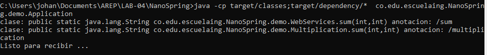
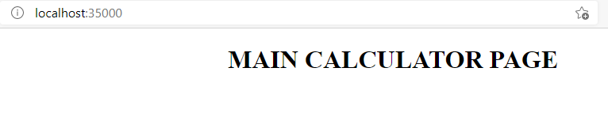
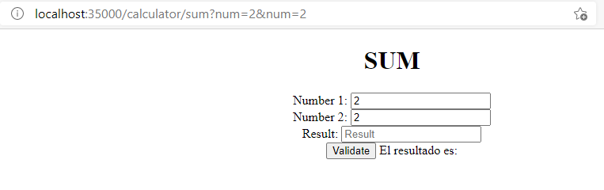
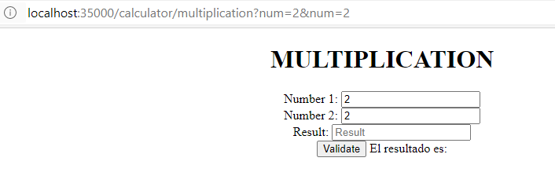
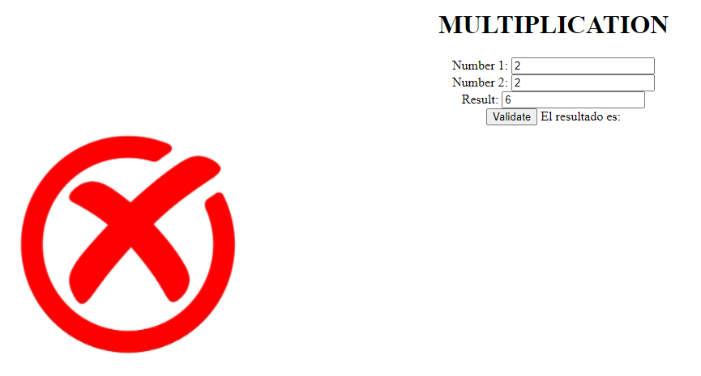
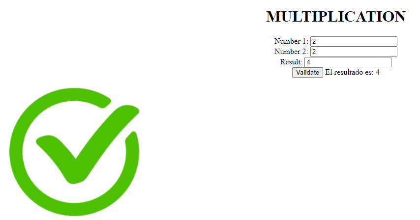

# Proyecto realizado por Johann Steven Bogotá
# Laboratorio 04 AREP

Para este taller los estudiantes deberán construir un servidor Web (tipo Apache) en Java. El servidor debe ser capaz de entregar páginas html e imágenes tipo PNG. Igualmente el servidor debe proveer un framework IoC para la construcción de aplicaciones web a partir de POJOS. Usando el servidor se debe construir una aplicación Web de ejemplo y desplegarlo en Heroku. El servidor debe atender múltiples solicitudes no concurrentes.

Para este taller desarrolle un prototipo mínimo que demuestre capacidades reflexivas de JAVA y permita por lo menos cargar un bean (POJO) y derivar una aplicación Web a partir de él. Debe entregar su trabajo al final del laboratorio.


## Compilar programa
- Para construir el programa y ejecutar todas las fases de un repositorio maven
```
mvn clean install
``` 
- Para correr los tests
```
mvn test
```
- Para generar la documentación
```
mcn javadoc:javadoc o mvn javadoc:jar (generar jar)
```

## Ejecutar Programa
Una vez compilada la aplicación podemos usar el siguiente comando: **java -cp target/classes:target/dependency/*  co.edu.escuelaing.NanoSpring.demo.Application**



## Como usar el aplicativo
Este aplicativo se basa en una calculadora que funciona para validar operaciones que realiza el usuario, por el momento se tiene el servicio de suma y multiplicación, la primera petición envia los parametros por medio de la URL, ya las interacciones dentro del servicio se realiza por medio de un JAVASCRIP.

Una vez ejecutado el programa, podemos acceder de forma local en el navegador a la siguiente dirección **http://localhost:35000/**.
Este nos nos enviara a una página de presentación.



Para poder acceder a los servicios que presenta la aplicación, debemos acceder por medio de la URL enviandole los parametros, por ejemplo: **http://localhost:35000//calculator/multiplication?num=2&num=2**
- Para acceder al servicio de suma debemos ir al recurso /sum con los parametros quiera poner

- Para acceder al servicio de multiplicacion debemos ir al recurso /multiplication con los parametros quiera poner


La aplicación tiene un boton de validacion, para verificar si la respuesta que coloca el usuario es correcta



## Enlace Heroku
[](https://lab04arep.herokuapp.com)
## Licencia
Ver licencia en LICENCE.txt para más detalles.